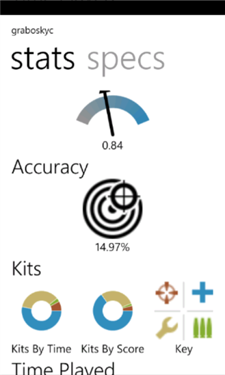

# BFStats

## Background
This is a simple app for Windows Phone 7, written in Silverlight, that pulls data from BF3Stats.com and presents it. There is a background agent to poll updates in background and update live tile. It also runs on WP8.

This project has been abandoned, because use of Battlefield 3 is pretty much done, as is Windows Phone 7.

However it served as a fun way to learn Silverlight (which was my favorite language).

